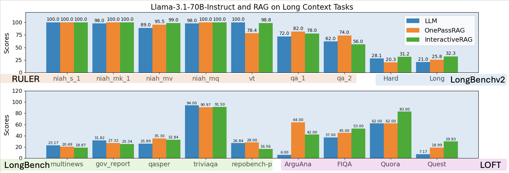
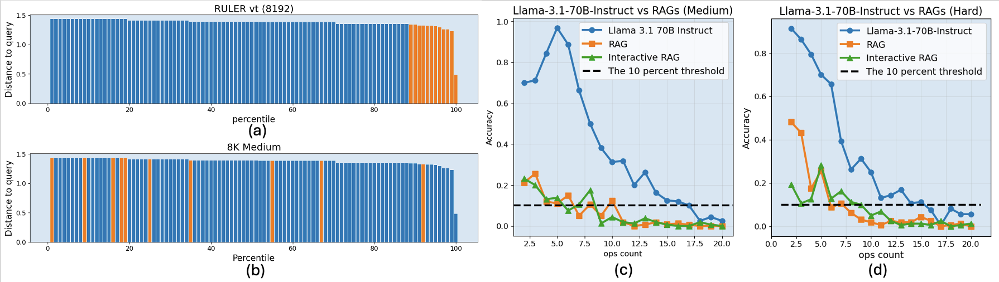

<!-- ARTEMIS-IGNIS-BRANDING:START -->
<p align="center">
  
</p>

<p align="center">
  
</p>
<!-- ARTEMIS-IGNIS-BRANDING:END -->

<div align="center">
<h1> GSM-Infinite</h1>
<p><em>Infinitely Scalable Long-context Reasoning Benchmark for Large Language Models</em></p>
</div>

<div align="center">

[](https://arxiv.org/abs/2502.05252)
[](https://infini-ai-lab.github.io/gsm_infinite/)
[](https://infiniailab-gsm-infinite-leaderboard.hf.space)
[](https://huggingface.co/collections/InfiniAILab/gsm-infinite-67aa7b323eb5c4d9c693fe6a)
<!-- [](LICENSE) -->

</div>

<div align="center">
<b><a href="https://github.com/YangZhou08">Yang Zhou*</a></b><sup>1</sup>,
<b><a href="">Hongyi Liu*</a></b><sup>1</sup>,
<b><a href="https://github.com/dreaming-panda">Zhuoming Chen</a></b><sup>1</sup>,
<b><a href="">Yuandong Tian</a></b><sup>2</sup>,
<b><a href="https://github.com/keroro824">Beidi Chen</a></b><sup>1</sup>
<br>
<sup>*</sup>Equal Contributions | <sup>1</sup>Carnegie Mellon University | <sup>2</sup>Meta AI
</div>

---

<h2>Limitation of Existing Long-context Benchmark</h2> 
<div align="center">

<figcaption>RAG can robustly solve most of today popular long-context benchmarks</figcaption> 
</div> 
In this paper, we first point out the insufficiencies in long-context LLMs evaluation, highlighting: 
<ol>
<li>
    <span style="font-weight: bold; color: dodgerblue">Lack of reasoning complexity</span>: Most tasks rely on text retrieval, text summarization, QA. 
</li>
<li>
    <span style="font-weight: bold; color: dodgerblue">Lack of context length</span>: Some tasks are inherently short-context tasks but are bloated to long-context through injecting semantically irrelevant noise. 
</li> 
<li> 
    <span style="font-weight: bold; color: dodgerblue">Lack of scalability</span>: Admittedly, tasks with high reasoning complexity and high information density exists, but these tasks requires huge human-effort to gather, dedup, and verify. The result is lack of scalability in quantity, making it hard to prevail in the community. 
</li> 
</ol> 
First two is further studied in the above figure. These tasks are not tasks that only long-context LLMs can do. We show that RAG are robust and have performance on par with long-context LLMs. However, given the high efficiency to build and run inference on RAG systems, RAG is more favorable in practice on these tasks. Therefore, we have the following problem to solve. 
<p>
    <span style="font-weight: bold; color: dodgerblue">Problem Statement</span>: How can we develop a benchmark that contains sufficient problems at every fine-grained level of reasoning difficulty, from easy retrieval tasks to infinitely hard challenges, while providing infinitely customizable context length with high information density? 
</p> 

## Overview

GSM-Infinite is a **completely synthetic reasoning benchmark** that generates problems with infinitely scalable context length and reasoning complexity. Unlike existing benchmarks that rely on text retrieval or summarization, GSM-Infinite creates high information density tasks that can only be solved by long-context LLMs, not by RAG systems.

### Key Features

- 🔄 **Infinitely Scalable**: Generate problems of any context length and reasoning complexity
- 🧮 **High Information Density**: Every token matters - RAG systems cannot solve these problems
- 🎯 **Three Difficulty Levels**: Symbolic, Medium, and Hard subsets
- 📊 **Comprehensive Evaluation**: Built-in evaluation scripts and leaderboards
- 🔬 **Synthetic Generation**: No LLMs in the loop, ensuring unbiased benchmarks

### Why GSM-Infinite?

<div align="center">

<p><em>RAG systems fail on GSM-Infinite due to high information density</em></p>
</div>

Traditional long-context benchmarks can often be solved by RAG systems, making them insufficient for evaluating true long-context reasoning. GSM-Infinite addresses this by:

1. **High Information Density**: Every part of the context is essential
2. **Reasoning Complexity**: Requires multi-step mathematical reasoning
3. **Infinite Scalability**: Generate unlimited test cases at any difficulty

## Quick Start

### Installation

```bash
# Clone the repository
git clone https://github.com/Infini-AI-Lab/gsm_infinite.git
cd gsm_infinite

# Install dependencies
pip install -r requirements.txt

# or
pip install -e .
```

### Basic Usage

1. **Configure your setup** by editing `gsm-infinite/config.sh`:
   ```bash
   # Set your API configuration
   backend_type='openai'  # or 'gemini', 'anthropic'
   SAMPLER_OPENAI_BASE_URL='your_api_url'
   SAMPLER_OPENAI_API_KEY='your_api_key'
   
   # Configure model and dataset
   model_name='your_model_name'
   save_name='your_save_name'
   ```

2. **Run evaluation**:
   ```bash
   cd gsm-infinite
   bash run.sh
   ```
Results are stored in `gsm-infinite/results`

3. **View results** with the interactive dashboard:
   ```bash
   streamlit run app.py
   ```

## Project Structure

```
gsm_infinite/
├── gsm-infinite/           # Main package
│   ├── app.py             # Streamlit results viewer
│   ├── config.sh          # Configuration file
│   ├── run.sh             # Main execution script
│   ├── preprocess.py      # Data preprocessing
│   ├── data/              # Data generation modules
│   │   ├── symbolic/      # Symbolic dataset generation
│   │   └── realistic/     # Medium/Hard dataset generation
│   └── pred/              # Prediction and evaluation scripts
├── docs/                  # Detailed documentation
├── static/                # Web assets and images
├── requirements.txt       # Python dependencies
└── pyproject.toml        # Package configuration
```

## Dataset Information

GSM-Infinite provides three types of datasets:

| Dataset | Description | Context Length |
|---------|-------------|----------------|
| **Symbolic** | Abstract mathematical operations | 0-32K+ tokens |
| **Medium** | Realistic problems with at most 2-entity implicit relationship | 0-32K+ tokens |
| **Hard** | Realistic problems with at most 3-entity implicit relationship | 0-32K+ tokens |

## Documentation

For detailed information, please refer to our comprehensive documentation:

- 📖 **[Installation Guide](docs/INSTALLATION.md)** - Detailed setup instructions
- 🚀 **[Usage Guide](docs/USAGE.md)** - Complete usage examples
Evaluate your models -->
- 🏆 **[Leaderboards](docs/LEADERBOARDS.md)** - Current model rankings
<!-- - 🔧 **[Data Generation](docs/DATA_GENERATION.md)** - Generate custom datasets -->
<!-- - 📊 **[Evaluation Guide](docs/EVALUATION.md)** - 
<!-- - 🔍 **[API Reference](docs/API_REFERENCE.md)** - Configuration options -->
<!-- - 🤝 **[Contributing](docs/CONTRIBUTING.md)** - How to contribute -->

## Results

Our benchmark reveals significant differences in long-context reasoning capabilities across models. See our [leaderboards](https://infiniailab-gsm-infinite-leaderboard.hf.space) for the latest results.

For complete results and analysis, visit our [paper](https://arxiv.org/abs/2502.05252) and [leaderboard](docs/LEADERBOARDS.md).

## Citation

If you use GSM-Infinite in your research, please cite our paper:

```bibtex
@misc{zhou2025gsminfinitellmsbehaveinfinitely,
    title={GSM-Infinite: How Do Your LLMs Behave over Infinitely Increasing Context Length and Reasoning Complexity?}, 
    author={Yang Zhou and Hongyi Liu and Zhuoming Chen and Yuandong Tian and Beidi Chen},
    year={2025},
    eprint={2502.05252},
    archivePrefix={arXiv},
    primaryClass={cs.CL},
    url={https://arxiv.org/abs/2502.05252}, 
}
```

<!-- ## License -->

<!-- This project is licensed under the MIT License - see the [LICENSE](LICENSE) file for details. -->

## Support

- 🐛 **Issues**: [GitHub Issues](https://github.com/Infini-AI-Lab/gsm_infinite/issues)
- 💬 **Discussions**: [GitHub Discussions](https://github.com/Infini-AI-Lab/gsm_infinite/discussions)
- 📧 **Contact**: [yangzho6@andrew.cmu.edu](mailto:yangzho6@andrew.cmu.edu)

---

<div align="center">
Made with ❤️ by the Infini-AI Lab team
</div>


